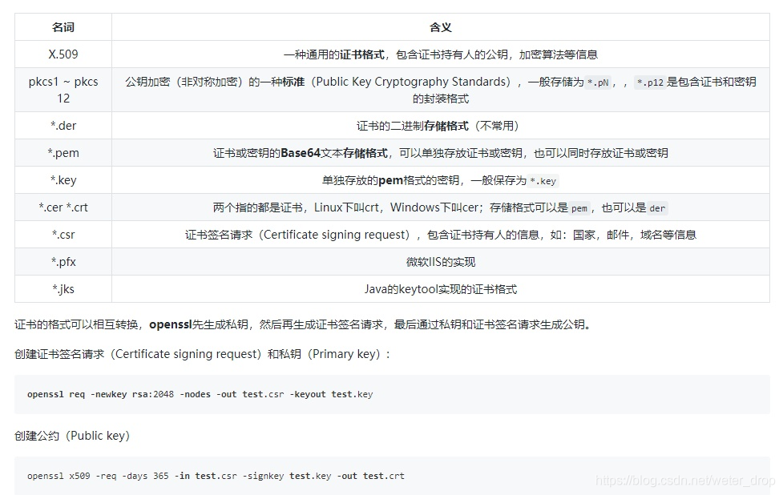

# flask-demo

主要功能

- 播放网络视频源 MP4、FLV 视频

- 播放本地视频

- 文件上传服务器功能

python 环境：Python 3.7.7

创建虚拟环境：

`python -m venv .venv`

切换至虚拟环境：

`source .venv/Scripts/activate` #Linux

`.venv\Scripts\activate` #Windows

安装依赖包：

`pip install -r requirements.txt`

Windows 编译：

`pyinstaller -Fc app.py -i icon.ico --version-file=version_info.txt -n=m3u8parse --add-data="templates;templates" --clean -y`

# SSL 证书

## 创建根证书

`openssl genrsa -out rootCA.key 2048`

`openssl req -nodes -x509 -new -key rootCA.key -sha256 -days 365 -out rootCA.pem`

复制一份 cer 的公钥安装证书
`cp rootCA.pem rootCA.cer`

查看证书信息
`openssl x509 -text -in rootCA.cer -noout`

## 创建服务器证书

`openssl genrsa -out server.key 2048`

`openssl req -new -key server.key -out server.csr`

创建 ssl.cnf 配置文件

```conf
basicConstraints = CA:FALSE
authorityKeyIdentifier = keyid:always, issuer:always
keyUsage = nonRepudiation, digitalSignature, keyEncipherment, dataEncipherment
subjectAltName = @alt_names
[ alt_names ]
DNS.0 = localhost
IP.0 = 127.0.0.1
IP.1 = ::1
IP.2 = 192.168.1.1
```

`openssl x509 -req -in server.csr -CA rootCA.pem -CAkey rootCA.key -CAcreateserial -out server.pem -days 180 -sha256 -extfile ssl.cnf`

验证测试

* 验证域名

`openssl verify -CAfile rootCA.pem -verify_hostname localhost server.pem`

* 验证IP

`openssl verify -CAfile rootCA.pem -verify_ip 127.0.0.1 server.pem`

成功会显示`server.pem: OK`

安装 rootCA.cer，服务器上使用 server.key 和 server.pem



# ffmpeg m3u8生成

`openssl rand 16 > file.key`

`echo https://localhost/static/ile.key > file.keyinfo`

`echo file.key >> file.keyinfo`

`echo $(openssl rand -hex 16) >> file.keyinfo`

`ffmpeg.exe -i video.mp4 -c copy -f hls -hls_time 2 -hls_list_size 0 -hls_key_info_file file.keyinfo -hls_base_url "https://localhost/static" -hls_playlist_type vod -hls_segment_filename "video%4d.ts" playlist.m3u8`